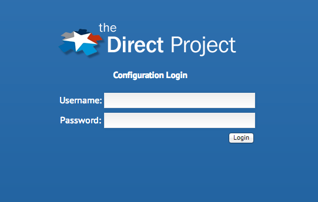
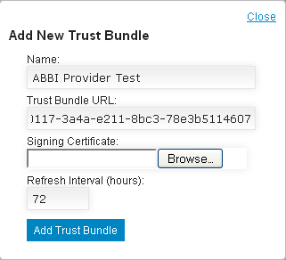
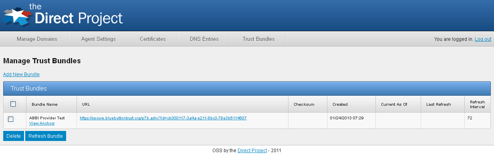
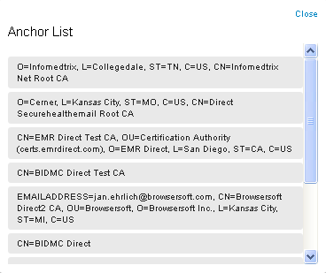
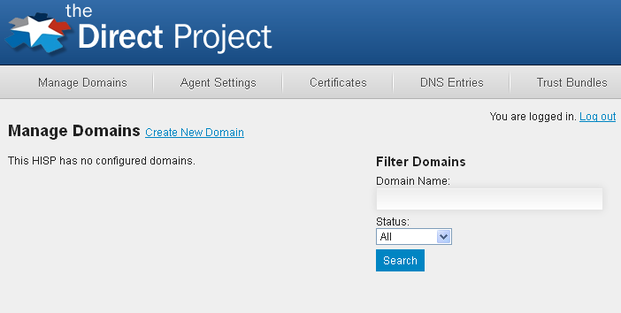
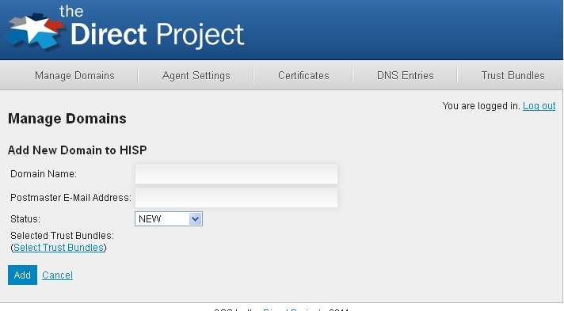
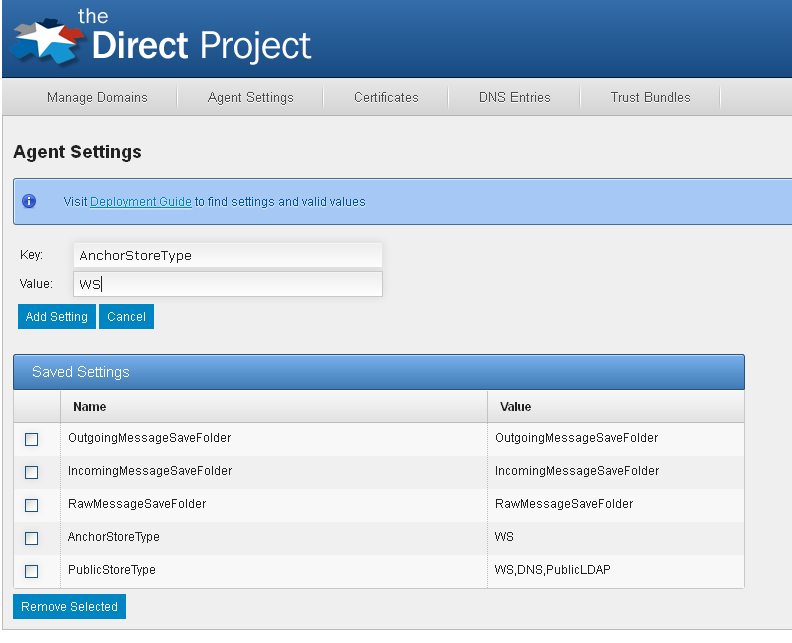
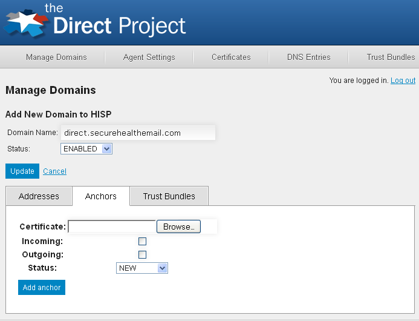
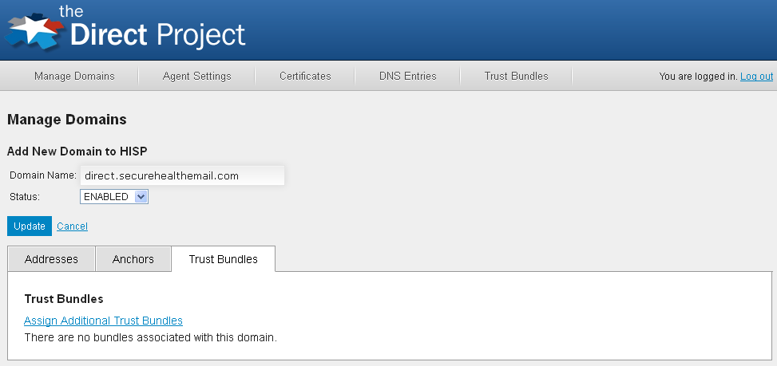
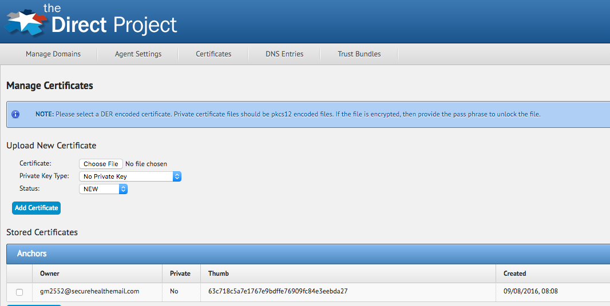

# SMTP Agent WebService Configuration

WebService configuration for the SMTP protocol consists of an retrieving configuration parameters for both the SMTP agent and the security and trust agent from the DirectProjectconfiguration service. The configuration service exposes a web interface using a RESTful interface and can be accessed using a simple URL. Example:

```
http://myserver/config-service/
```

Be default, the services are protected with Basic Auth.

Many configuration settings are persisted in the config-store implementation of the web service, typically in a database.  The settings in the web service are configuration via tooling through a web application; the config-ui.



Several aspects of the SMTP agent from domains to certificate storage locations can be configured through configuration web UI. Certificates, trust anchors, and trust bundles themselves can be stored in the configuration service and accessed through the web service interface.

Configuration or the SMTP agent is separated into five components, however they are related to each other:

* Domains - The list of domains managed by the agent.
* Certificates - Private and optionally public certificate storage.
* Trust Anchors - Trust anchor certificate storage for course grain anchor configuration.
* Trust Bundles - Collections of anchors published by trust communities.
* Settings - Configuration settings for numerous components of a HISP. These are generally higher level configuration settings. Fine grained tuning is available via the [OptionsManager](http://api.directproject.info/direct-common/6.0/apidocs/org/nhindirect/common/options/OptionsManager.html).

Domains, certificates, trust anchors, and trust bundles have specific configuration elements stored in the settings component.

## Trust Bundles

Trust bundles are a collection of trust anchors that are intended to represent a trust community and generally meet a common set of criteria to be included in the bundle. Trust bundles are packaged into a single file using the PKCS7 standard and distributed via a known URL (the location is discovered out of band). Trust bundles are configured in the Trust Bundles tab of the configuration UI tool.

The Java reference implementation treats bundles as wholistic objects and does not support exclusion of anchors within the bundle. This is partly because the definition of a bundle indicates that each anchor within the bundle meets the same minimal requirements. The decision to include a bundle becomes a simple binary decision, you either trust the bundle or you don't.

Bundles are configured separately from domains as opposed to the importing of anchors per domain (as you will see in the next section). Each bundle is identified by a name and its URL.

To add a trust bundle, click the *Add New Bundle* link from the configuration UI TrustBundles tab.


The Add New Trust Bundle dialog will display waiting for you enter in the following information:

* **Name (Required):** A unique name of the bundle that describes the trust community of the bundle.
* **Trust Bundle URL (Required):** The fully qualified URL where the trust bundle can be retrieved.
* **Signing Certificate (Optional):** If the bundle has been signed, this is the certificate that signed the bundle to validate the integrity of the bundle. NOTE: It is completely optional to validate the bundle integrity against a signing certificate. If the bundle has not been signed, the signing certificate is ignored.
* **Refresh Interval (Required):** Indicates the frequency that the system will look for updates to the bundle. If this value is 0, then the system will never automatically look for updates, however you can always check for updates manually by clicking the refresh button.



Once the bundle has been added, it will appear in the table of bundles; however, some of the fields will be empty. This is because the bundle is downloaded from the provided URL in the background and information is updated in the table at a later time.



If the bundle is successfully downloaded and optionally validated, the table will be updated (you may need to click on another tab and come back to the trust bundle tab to see the updates).


The table contains the following information:

* **Bundle Name:**	The bundle name
* **URL:** The URL where the bundle is downloaded from
* **Checksum:**	A SHA1 hash of the bundle
* **Created:** The date/time when the bundle entry was created in the system.
* **Current As Of:** The date when the bundle was last updated in the system
* **Last Refresh:** The date and time when the system last checked for an update. If a newer/different bundle was found, the Current As Of date is also updated. If not updates were found, then the Current As Of date does not change.
* **Refresh Interval:**	How often (in hours) updates are automatically check

If you would like to see the anchor within a bundle, simply click the **View Anchors** link under the bundle name. This will display a list with the *Distinguished Name* of each anchor.



To remove a bundle from the system, check the box next to the name of each bundles that you want to remove and click the **Delete** button. If you delete a bundle that has been associated to a domain, the association is automatically removed.

During the operation of your HISP, it may be necessary to updated bundles in between their configure refresh cycle. To manually refresh/update a bundle, check the box next to the name of the bundles you want to update. The update operation is a background procedure, so the information in the table will not be updated immediately. You may need to click on another tab and come back to the trust bundle tab to see updates.

## Domains

The domains component describes the list of domains that will be managed by the agent. Domains are created and maintained in the configuration UI tool.

To create a new domain, click the new **Create New Domain** link from the configuration UI Manage Domains tab (the first page after logging in).



Each domain requires the domain name and an option postmaster address. Enter the domain name, postmaster address, set the status to enabled, and click add. Optionally, trust bundle can be added at this time by clicking **Select Trust Bundles**. If you choose not to add bundles at this time, you may do so later. **NOTE:** If the postmaster address is not specified, the SMPT Agent will default it to postmaster@<domain name>.



##### Anchors

Anchors define the certificates that create trust between domains.

Each domain must have at least one outgoing or incoming trust anchors. Anchors can be retrieved from different source mediums including the configuration service. The anchor storage medium is configured in the settings page of the configuration UI. All settings are configured as simple name/value pairs.



##### Anchor Store Settings

| Setting | Description |
| --- | --- |
| AnchorStoreType | The storage type of the anchor store. Valid types: WS (default): Anchors are stored in the configuration service. |
| AnchorResolverType | The type of the anchor resolver. Valid types: **Uniform:** All domains use the same anchors for all addresses. **Multidomain:** Each domain defines its own discrete set of trust anchors. |

###### Web Service Anchor Storage

Anchors stored in the configuration service are added and maintained in the *Anchors* tab of the configuration service *Manage Domains* page.



The certificate field is the location of the DER encoded certificate file that represents the trust anchor. Incoming and outgoing indicates if the trust anchor should be used for incoming or outgoing anchors. Clicking **Add Anchor** will add the anchor to the domain indicated by the *Domain Name* field and upload the anchor to the configuration service.

**NOTE:** Regardless of the storage mechanism, a domain should always add its own trust anchor to its list or trusted anchors. This is a security precaution to ensure only users with valid certificates signed by the trust anchor can send from the agent's managed domain(s).


##### Trust Bundles

Configured trust bundles can be added to a domain from the *Trust Bundles* tab of the configuration service *Manage Domains* page. Each anchor in the bundle is used to create trust between the domain and the system represented by the anchor. Similar to configuring anchors, each bundle can be set to incoming or outgoing to control the direction of trust.



To associate one or more bundles to a domain, click the **Assign Additional Trust Bundles** link. Select each bundle and select if the bundle should be incoming, outgoing, or both.


## PublicCertStore

Similar to anchors, public certificates can be retrieved from different source mediums. The public certificate storage medium is configured in the settings page of the configuration UI.

##### Public Certificate Store Settings

* **PublicStoreType:** The storage type of the public certificate store. Valid types: 
  * **DNS:** Certificates are resolved using DNS.
  * **KEYSTORE:** Certificates are stored in a local keystore file. 
  * **WS:** Public certificates are stored in the configuration service. 
  * **PublicLDAP:** Certificates are resolved from publicly accessible LDAP servers. LDAP servers are resolved dynamically using DNS SRV. 
* **PublicStoreFile:** For keystore store types, the name of the file that contains the certificates. This can be just a file name, a fully qualified path, or a relative path.
* **PublicStoreFilePass:** For keystore store types, an optional password used to encrypt the file.
* **PublicStorePrivKeyPass:** For keystore store types, an optional password used to encrypt private keys.
  
In some cases, multiple store types may be necessary to resolve a public certificate. For example some HISPs use DNS to distributed public CERT while others may use out of band processes and require a HISP to manually import the CERT(s) into the storage medium. Multiple store types are separated by a comma (,).  The default value is: DNS,PublicLDAP

## PrivateCertStore

The private certificate storage medium is configured in the settings page of the configuration UI.

##### Private Certificate Store Settings

* **PrivateStoreType:** The storage type of the public certificate store. Valid types: 
  * **KEYSTORE:** Certificates are stored in a local keystore file. 
  * **WS (default):**  Certificates are stored in the configuration service. 
  * **LDAP:** Certificates are stored in an LDAP server.
* **PrivateStoreFile:** For keystore store types, the name of the file that contains the certificates. This can be just a file name, a fully qualified path, or a relative path.
* **PrivateStoreFilePass:** For keystore store types, an optional password used to encrypt the file.
* **PrivateStorePrivKeyPass:** For keystore store types, an optional password used to encrypt private keys.
* **PrivateStoreLDAPUrl:** For LDAP store types, the url to the LDAP server. Consists of the protocol, host, and port. Multiple URLs can be define and are comma delimeted. Example: ldap://somehost:389
* **PrivateStoreLDAPUser:** For LDAP store types, the user name credential for connecting to the LDAP store. May be empty if the LDAP server allows anonymous binding.
* **PrivateStoreLDAPPassword:** For LDAP store types, The password credential for connecting to the LDAP store.
* **PrivateStoreLDAPConnTimeout:** For LDAP store types, an optional timeout in seconds before the connection is failed.
* **PrivateStoreLDAPSearchBase:** For LDAP store types, the distinguished name used as the base of LDAP searches.
* **PrivateStoreLDAPSearchAttr:** For LDAP store types, the attribute in the LDAP store that is used to match a search query.
* **PrivateStoreLDAPCertAttr:** For LDAP store types, the attribute in the search query result that holds the certificate file.
* **PrivateStoreLDAPCertFormat:** For LDAP store types, the format of the certificate in the LDAP store. Valid formats: pkcs12, X.509
* **PrivateStoreLDAPCertPassphrase:** For LDAP store types and pkcs12 files, the pass phrase used to encrypt the certificate.

##### Web Service Private/Public Certificate Storage

Private and public certificates stored in the configuration service are added and maintained in the *Manage Certificates* page of the configuration service application.



Certificates can be uploaded in the multiple formats and may or may not include a private key. The *Private Key Type* drop down determines the format of the certificate you are uploading. The following formats below are supported along with what type of files should be uploaded with each (NOTE: All formats are expected to use DER encoding).

* **No Private Key:** The certificate field is the location of the certificate file that represents public certificate. No private key is provided.
* **Unprotected PKCS12:** The certificate field is the location of a PKCS12 file (most likely has an extension of .p12) that contains both the certificate and private key, but the file does use any encryption. A password is not needed for this format type.
* **Password Protected PKCS12:** The certificate field is the location of a PKCS12 file (most likely has an extension of .p12) that contains both the certificate and private key, and the file is encrypted. A password is entered in the Pass Phrase field to decrypt the file.
* **Unprotected PKCS8:** The certificate field is the location of a certificate file and the private private key is the location of the private key file. The private key is not encrypted, and a password is not needed for this format type.
* **Password Unprotected PKCS8:** The certificate field is the location of a certificate file and the private private key is the location of the private key file. The private key is encrypted, and a password is entered in the Pass Phrase field to decrypt the private key.
* **Wrapped PKCS8:** The certificate field is the location of a certificate file and the private private key is the location of the private key file. The private key is encrypted, but is wrapped using a secret key from a hardware security module. In this case, the private key remains in it's wrapped state and is only unwrapped when activated by the security and trust agent for signing and decryption operations.

Clicking **Add Certificate** will add the certificate and optional private key to the configuration service. **NOTE:** The owner is automatically populated by the service when the certificate is added.

**NOTE:** Private certificate files should be pkcs12 der encoded files with either encryption or no encryption on the private key stored in the file. If the private key is encrypted, then the correct pass-phrase must be provided (the certificate will fail to load if the wrong pass-phrase is provider). Although pkcs12 files can be created from open source tools such as openssl, the Java Reference implementation agent module contains a tool for creating pkcs12 files in the expected format from DER encoded X509 certificates and pkcs8 DER encoded private key files.
  
## XXMessageSettings

The following settings describes the location where processed messages should be stored. This is intended for debug purposes only and should not be set in a production environment.

MessageTypes:

* **Raw:** The raw message that entered the SMTP agent.
* **Outgoing:** If the message is determined to be an outgoing message, the security and trust processed outgoing message.
* **Incoming:** If the message is determined to be an incoming message, the security and trust processed incoming message.
* **Bad:** Messages that failed to be processed or caused other errors to be the thrown.

| Setting | Description |
| --- | --- |
| RawMessageSaveFolder | The folder where raw messages will be stored. If the folder does not exist, the system will automatically created it as long as the agent's process has permission to do so. |
| OutgoingMessageSaveFolder | The folder where outgoing messages will be stored. If the folder does not exist, the system will automatically created it as long as the agent's process has permission to do so. |
| IncomingMessageSaveFolder | The folder where incoming messages will be stored. If the folder does not exist, the system will automatically created it as long as the agent's process has permission to do so. |
| BadMessageSaveFolder | The folder where bad messages will be stored. If the folder does not exist, the system will automatically created it as long as the agent's process has permission to do so. |

## MDN Settings

The agent automatically produce MDN message for all successfully processed messages with a disposition of Processed. MDN is described in [RFC3798](http://tools.ietf.org/html/rfc3798) and is intended (for the SMTP Agent purposes) to indicate the successful reception and processing of message by the security and trust agent.

| Setting | Description |
| --- | --- |
| MDNProdName | The product name used in the user agent header of the MDN message. Defaults to Security Agent if this attribute is not present. |
| MDNText | Human readable response text sent back to the sender indicating a successful reception of the senders message. |